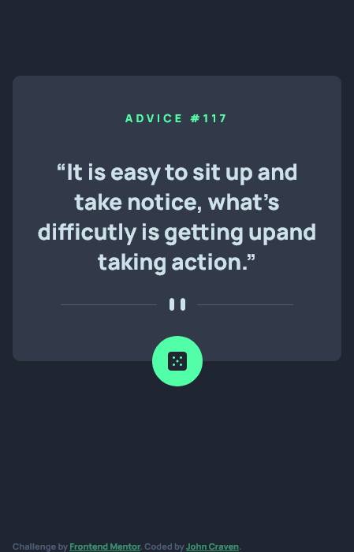

# Frontend Mentor - Advice generator app solution

This is a solution to the [Advice generator app challenge on Frontend Mentor](https://www.frontendmentor.io/challenges/advice-generator-app-QdUG-13db). Frontend Mentor challenges help you improve your coding skills by building realistic projects.

This was a basic project just to get familiar with a basic flow for fetching from a web api and swapping content. On the [live page]( https://johncraven.github.io/fem-advice-generator/) you can pull new advice from the [Advice Slip API](https://api.adviceslip.com).

