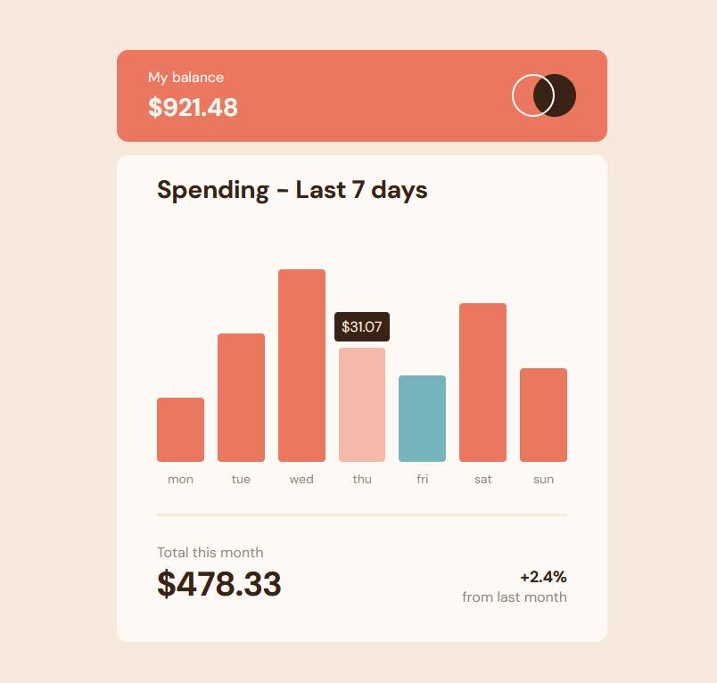

# Frontend Mentor - Expenses chart component solution

This is a solution to the [Expenses chart component challenge on Frontend Mentor](https://www.frontendmentor.io/challenges/expenses-chart-component-e7yJBUdjwt). Frontend Mentor challenges help you improve your coding skills by building realistic projects.

## The challenge

Users should be able to:

- View the bar chart and hover over the individual bars to see the correct amounts for each day
- See the current day’s bar highlighted in a different colour to the other bars
- View the optimal layout for the content depending on their device’s screen size
- See hover states for all interactive elements on the page
- **Bonus**: Use the JSON data file provided to dynamically size the bars on the chart

## My solution

I stuck with using mostly HTML/CSS for this challenge, but did opt to write a bit of javascript to populate the chart with values from the provided json file. I hosted a [live version of the static site](https://johncraven.github.io/fem-expenses/) on github pages.

The trickiest bit here was setting up the chart itself. I chose to just use html elements for the bar chart, but it devolved into a bit of "div soup". In a real project with lots of data to present, I think I'd try to use a charting library to take away some of that boilerplate.

I got stuck implementing the color change on the hover because I didn't want the opacity to color the detail callout that appears as well. To solve that, I had to go back and rearrange the html elements so that the color for the bar was actually coming from a nested element so that its opacity wouldn't affect the callout, but they could have the same parent that would take the bar height. This seems overcomplicated, but I wasn't sure how else to implement it.

The layout for the other elements was a snap with flex, but I think I could do better at trying to make reusable classes instead of styling each element individually. On these small challenges it is tricky to imagine which components you would want to reuse when it isn't part of a larger project. Maybe that means I need to tackle some larger projects instead!