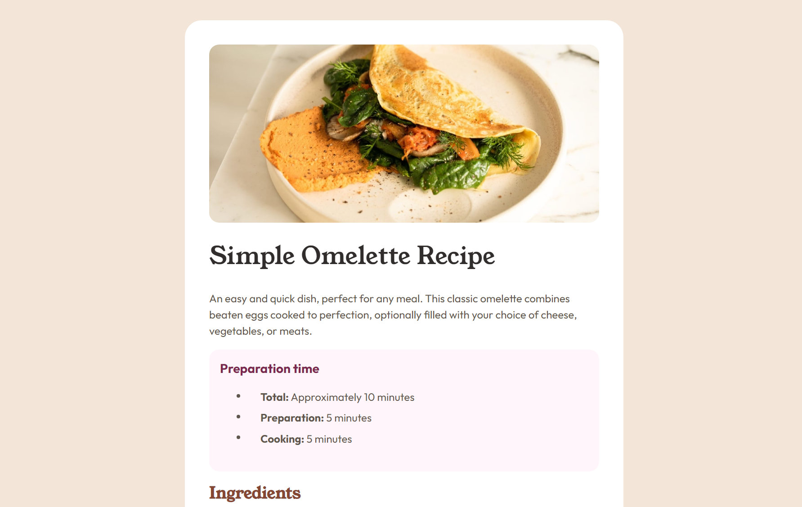

# Frontend Mentor - Recipe

This is a solution to the [Recipe page challenge on Frontend Mentor](https://www.frontendmentor.io/challenges/recipe-page-KiTsR8QQKm).

Check out my [live solution](https://johncraven.github.io/frontendmentor-challenges/recipe-page-main/index.html)

I haven't been coding recently so I gave this challenge a shot to knock the rust off. I played around a bit with trying to write BEM style CSS but I'm not sure I quite got the trick. Particularly it seemed like I ended up using block elements in the css more than using the actual classes.

I did enjoy playing around a bit more with list styling. At first I thought getting everything aligned between sections might be annoying, but I didn't realize that by default the bullet points are outside of the actual element. Getting the vertical alignment was a bit more unintuitive though, I ended up wrapping the text of each list item in a inline-block paragraph and then aligning that to middle... but I don't really understand why that worked 😅.

