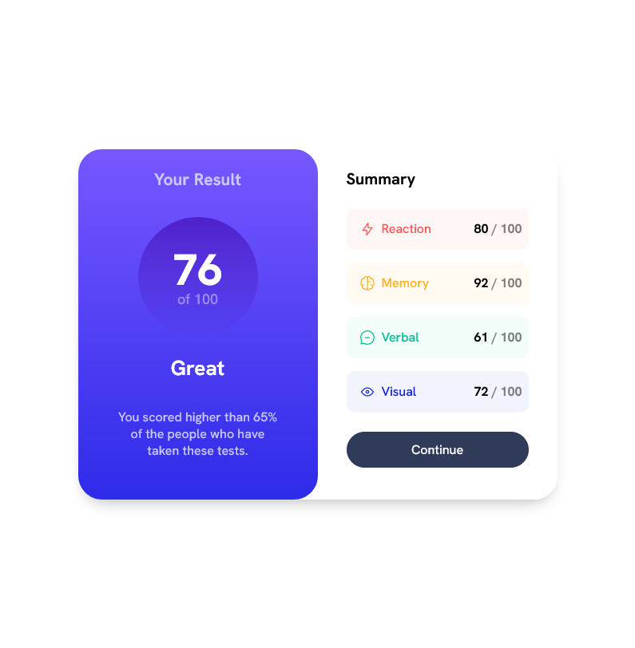

# Frontend Mentor - Results summary component solution

This is a solution to the [Results summary component challenge on Frontend Mentor](https://www.frontendmentor.io/challenges/results-summary-component-CE_K6s0maV). Frontend Mentor challenges help you improve your coding skills by building realistic projects.

Check a [hosted version of my solution]( https://johncraven.github.io/fem-score-component/). I hardcoded the fields to keep it simple but tried to leave span elements to help select where data might get populated. Need to work on structuring the CSS with utility classes to keep from repeating the same layout code.

